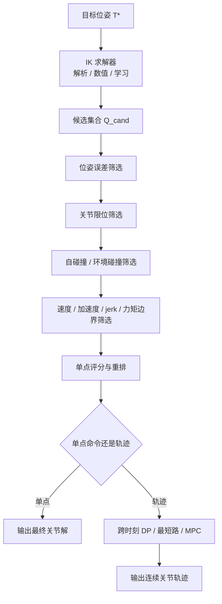

# 常见机器人逆运动学求解器的多候选解机制与最终解选择

## 执行摘要

一个常见误区，是把“求解器返回的候选关节解数量”直接理解成“机构真实存在的精确逆解数量”。这对 7-DOF 冗余机械臂并不成立。对一般 6R 串联臂，给定完整 6D 末端位姿时，逆运动学通常对应**有限个离散分支**，经典代数几何结果给出一般 6R 最多可有 16 个解；而对 7R 冗余臂，给定同样的位姿时，解集通常是一条**连续的一维自运动流形**，理论上不是“100 个解”，而是“无穷多解”。因此，像 Franka Panda 这类 7-DOF 机械臂在工程软件里出现“约 100 个候选解”，几乎总是因为软件对冗余参数做了**离散化采样**、对多个初值做了**多启动搜索**，或保留了**种群/采样式优化产生的多个候选**，而不是机构本体只有 100 个精确根。citeturn17search0turn17search5turn36view3

在工程生态中，**KDL / LMA / PyBullet** 这类数值类 IK 通常是“**单次调用返回 0/1 个解**”；**TRAC-IK** 会并行运行改进 Newton 法与 SQP，并提供“最快解 / 距离种子最近 / 最大可操作度”等二级选择准则，但 MoveIt/ROS 里它通常仍以“单次返回一个最终解”为主；**IKFast / OpenRAVE / Panda 专用解析解**则可以快速枚举**某个固定冗余参数下的离散分支**，进一步对自由参数做扫描后，就可能产生几十到几百个候选；**bio_ik / pick_ik / IKFlow / CycleIK** 则把“多候选”的来源转移到种群优化或生成模型采样。citeturn12view3turn26search0turn13view3

系统真正困难的部分，往往不是“求一个可达解”，而是“**从候选集里选出执行上最合适的那一个**”。这一步通常要分层完成：先做位姿误差、关节限位、自碰撞/环境碰撞、速度/加速度/jerk/力矩边界等**可行性筛选**；再按当前关节状态距离、关节限位裕度、可操作度、动力学代价、任务偏好等做**单点排序**；若目标是一串轨迹点，还要再做**跨时刻的连续性优化**，否则容易出现 elbow flip、branch switch 或局部最优抖动。对路径问题，逐点贪心选“最近解”通常不如在候选格点上做动态规划或最短路。citeturn27search0turn27search13turn25view0

如果只给一句工程结论：**高频、批量、近实时**的 Panda IK，优先用解析/编译型求解器生成候选，再在外层做碰撞与连续性筛选；**以稳健为主**的 MoveIt 规划，TRAC-IK 的 `Distance` 模式通常比默认 KDL 更可靠；**需要软约束、多目标和“看起来更像人”的肘部/姿态偏好**，则更适合 bio_ik 或 pick_ik；**如果希望一次拿到大量多样候选**，生成式学习方法如 IKFlow 更像“候选生成器”，而不是开箱即用的最终执行器。citeturn16view0turn13view3turn13view2

## 问题范围与核心判断

下表给出本文的范围与假设。除非特别说明，本文把“候选解选择”与“整条轨迹执行”区分讨论；单点 IK 的默认讨论对象是**固定基串联机械臂**，重点比较 6R 与 7R，示例采用 Franka Panda 一类 7-DOF 冗余臂。citeturn23view1turn36view3turn29view0

| 维度 | 本报告设定 | 说明 | 依据 |
|---|---|---|---|
| 机器人类型 | 固定基串联机械臂；重点比较 6R 与 7R；示例为 Franka Panda 一类 7-DOF 冗余臂 | 这是 MoveIt、TRAC-IK、IKFast、KDL、PyBullet 等主流 IK 生态最典型的对象 | citeturn23view1turn36view3turn16view2 |
| 任务空间 | 末端执行器完整 6D 位姿 | 也是大多数工业/研究 IK 文献与软件默认问题形式 | citeturn16view0turn12view2turn36view3 |
| 自由度与冗余 | 6R 为非冗余；7R 相对 6D pose 有 1 个冗余 DOF | 7R 给定位姿时通常对应连续自运动流形，而不是有限枚举集合 | citeturn36view3turn29view0turn28view0 |
| 关节限位 | **考虑** | 工程实现通常依赖 URDF / robot limits；KDL、LMA、TRAC-IK 都会读取或遵守这些限制 | citeturn12view3turn26search0turn13view4 |
| 碰撞 | **无特定约束** | 若进入 MoveIt/规划系统，碰撞通常由 Planning Scene/状态有效性回调在 IK 外层检查，而不是由通用 IK 求解器内生处理 | citeturn27search0turn27search13turn12view0 |
| 动力学 | **无特定约束** | 但真实 Franka 控制接口要求关节/笛卡尔速度、加速度、jerk、力矩及其变化率满足必要条件，否则会中止运动 | citeturn25view0 |
| 轨迹连续性 | **无特定约束** | 单点 IK 不自动保证整条轨迹平滑；对冗余臂通常要单独做分支保持或跨时刻优化 | citeturn28view0turn35search11 |

这里需要明确三个不同层次的“多解”：

> **机构层面的精确逆解分支**、**冗余机械臂的连续自运动流形**、以及**软件实现实际返回的有限候选列表**，并不是一回事。对 7-DOF Panda，后者往往是前两者经过离散化、随机重启或种群采样后的工程近似。citeturn36view3turn29view0turn28view0

对 7R 冗余臂，一个更自然的写法是把解集表示为：
\[
\mathcal{Q}^{*}(T^{*}) = \{ q(\alpha, b) \}
\]
其中 \(T^{*}\) 是目标位姿，\(\alpha\) 是一个连续冗余参数，比如末关节角、SEW/swivel 角或其他几何参数，\(b\) 是离散分支索引。软件若把 \(\alpha\) 以步长 \(\Delta\alpha\) 离散成 \(\alpha_k\)，实际得到的候选集就变成：
\[
\mathcal{Q}_{\mathrm{cand}}(T^{*}) = \{ q(\alpha_k, b) \}
\]
其规模近似满足：
\[
|\mathcal{Q}_{\mathrm{cand}}|
\approx
\left\lceil \frac{\alpha_{\max} - \alpha_{\min}}{\Delta\alpha} \right\rceil
\bar{B}\rho
\]
其中 \(\bar{B}\) 是平均可行分支数，\(\rho\) 是去重、限位与碰撞筛选后的保留比例。对 Panda，官方 URDF 中第 7 关节范围约为 \([-2.8973,\,2.8973]\) rad，总宽度约 5.79 rad；若以 0.05 rad 做示意性扫描，就已经有约 116 个自由参数样本点。再乘上解析分支并经过约束筛选后，得到“约 100 个候选解”非常正常。反过来，如果使用单种子局部数值法，则通常只会看到一个返回值。citeturn16view4turn16view1turn13view6

还有一个容易被忽略的学术细节：7R 冗余参数化本身会引入**算法性奇异点**。NASA 近期关于一般 7R 参数化的工作指出，SEW 一类参数化虽能把连续冗余压成一个标量，但**任何参数化都无法完全消除算法奇异性**；新的 stereographic SEW 只是把奇异线退到更不敏感的位置。GeoFIK 针对 Franka 进一步指出，Panda 的腕部和肘部偏置使得传统 7R 几何分析比标准 SRS 结构更复杂，因此“选什么自由参数”本身就会影响候选数量、稳定性和奇异位姿处理方式。citeturn36view3turn29view0

## IK 求解器类型、返回多解的机制与代表论文

从“会不会返回大量候选解”的角度看，IK 求解器最重要的区别，不是“解析还是数值”这么简单，而是它到底在求什么：是在求**所有离散根**，还是在求**连续冗余流形上的一个代表点**，抑或只是在**有限时间内找一个足够好的可行点**。下表按这一逻辑做分类。citeturn17search0turn12view2turn29view0

| 类别 | 代表算法 / 库 | 多解机制 | 典型解数量范围 | 优势 | 局限 | 代表来源 |
|---|---|---|---|---|---|---|
| 解析几何 / 闭式 | IKFast、Panda 专用几何解析解、GeoFIK、EAIK | 对非冗余问题或固定冗余参数的问题枚举离散分支；若对自由参数扫描，可得到大量候选 | 6R 常见为 0–16；Panda 固定 \(q_7\) 时至多 4 个实用分支；扫自由参数后可到几十到上百 | 微秒级、精确、适合大批量查询与规划 | 高度依赖机构结构；碰撞/动力学通常外置；7R 全空间不能“真正全部枚举” | citeturn16view0turn16view1turn9view2 |
| 代数几何 / 消元法 | Raghavan–Roth、Manocha–Canny、Husty 一类 | 把 IK 化成单变量多项式或特征值问题，求出所有离散根 | 一般 6R 最多 16 个 | 理论完整，适合“全根”分析 | 推导与数值稳定性处理较复杂；对冗余臂仍需额外参数化或搜索 | citeturn17search0turn17search5turn17search11 |
| 数值局部迭代 | Jacobian transpose、pseudoinverse、DLS、KDL、LMA | 每个种子通常收敛到一个局部代表解 | 单种子 0/1；多种子可到数个到十几个 | 通用、实现简单、易接入现有栈 | 对种子敏感；奇异点与局部极小值显著；通常不枚举多解 | citeturn12view2turn12view3turn26search0 |
| 约束优化 / 数值优化 | SQP、BFGS、TRAC-IK、NLP、QP/HQP | 多启动或并发优化在内部探索多个候选，但 API 常只返回“最佳一个” | 单次返回多为 0/1；内部会比较多个候选 | 比纯 Jacobian 法更稳健；易纳入软硬约束 | 速度受初值、阈值与超时影响；全局性有限 | citeturn13view3turn13view2turn12view1 |
| 启发式 / 采样 / 随机 | CCD、FABRIK、随机重启、GA、PSO、memetic | 通过多次迭代、重启或种群保留多个候选 | 从 1 个到上百，取决于预算 | 低门槛、可给出多样姿态、在高维问题上更灵活 | 精度与物理一致性依赖后处理；工业控制中常需精修 | citeturn40search17turn40search8turn9view6 |
| 学习型 / 生成型 | IKFlow、CycleIK、扩散类 IK、DNN 逆映射 | 直接采样解分布，天然适合生成多个多样候选 | 十几个到上千个 | 候选生成快，适合冗余与多峰分布 | 精确性、约束满足与 OOD 泛化通常需要经典方法精修 | citeturn22view1turn22view2turn34view1 |
| 混合型 | bio_ik、pick_ik、解析 IK + 学习型 redundancy selector | 把解析、局部优化、进化搜索、学习式重排结合 | 对外可返回 1 个，也可保留内部候选池 | 兼顾鲁棒性、速度与偏好建模 | 参数多，调参代价高；解释性因实现而异 | citeturn12view6turn13view0turn36view1 |

围绕“为什么有时候是 1 个解，有时候却是 100 个候选”，可以把多候选来源概括成三种。第一种是**离散分支枚举**，典型于 6R 闭式 IK；第二种是**连续冗余参数离散化**，典型于 7R 机械臂；第三种是**种子或种群多样化**，典型于随机重启、进化算法和生成模型。工程里最常见的“约 100 个候选”，几乎都属于后两类，而不是第一类。citeturn17search0turn36view3turn16view1

数值局部方法之所以常常只返回一个解，根源在于它们的目标通常是“从当前种子最快收敛到一个可行点”，而不是“枚举一个位姿对应的所有解”。Buss 的经典综述指出，pseudoinverse 在奇异附近不稳定，而 DLS/Levenberg–Marquardt 更稳定；KDL 的 `ChainIkSolverPos_NR_JL` 则明确是带关节限位的 Newton–Raphson 型位置 IK。它们的返回方式天然更接近“选代表点”。citeturn12view2turn12view3turn26search1

学习型方法在这里的价值，不一定是“取代”解析或优化，而是把它们变成**候选生成器或候选选择器**。IKFlow 明确把问题表述为“生成多样解分布”，对 Franka 这类冗余臂可在 10 ms 内采样 2000 个近似解，再由经典 IK 细化；CycleIK 也不是单纯前馈回归，而是把 MLP / GAN 与 SLSQP 或遗传算法组合成混合管线。更进一步的工作甚至不学 \(x\mapsto q\) 的全映射，而是学习**冗余参数的最优值**，再调用解析 IK 恢复精确关节角，从而把“求解”与“选解”分开。citeturn22view1turn22view2turn36view1

## Franka Panda 与类似 7-DOF 冗余臂的实际实现生态

Panda 在 MoveIt 教程中是旗舰示例，其官方 `kinematics.yaml` 示例默认使用 `kdl_kinematics_plugin/KDLKinematicsPlugin`，并暴露 `search_resolution`、`timeout` 与 `attempts` 等参数。这本身已经说明：在 MoveIt 里，7-DOF 冗余空间搜索不是“自动枚举全部解”，而是通过**离散化与超时控制**在有限工程预算内寻找可接受解。MoveIt 维护者在工作坊材料中也明确指出，对真正冗余的机械臂，解空间是连续流形，“找全部解”本身就不现实，必须离散化，并且历史上 MoveIt 的主流程也并不围绕“返回全部 IK 候选”设计。citeturn13view6turn28view0turn28view2

### 工程上最常见、最可用的实现

| 实现 | 方法类型 | 单次典型返回 | 是否会枚举多解 | 速度与鲁棒性 | 限位 / 碰撞 / 约束 | 开源入口与文档 |
|---|---|---|---|---|---|---|
| MoveIt + KDL | Newton–Raphson / Jacobian 数值法 | 0/1 | 否；主要依赖种子、随机重启与冗余搜索分辨率 | 默认插件；公开 7-DoF 基准中约 1.37–3.37 ms，成功率约 37.71%–83.14%，平台差异明显 | 关节限位内置；碰撞与可行性外置到 Planning Scene / callback | citeturn13view6turn12view3turn37view0 |
| MoveIt + LMA | Levenberg–Marquardt 数值法 | 0/1 | 否 | 比纯 Jacobian 方案更稳，但仍是局部法 | 关节限位内置；碰撞外置 | citeturn26search0turn26search1turn26search8 |
| TRAC-IK | 改进 Newton + SQP 并发混合 | 0/1 | 对外通常否；内部会竞争或排序多个候选 | 官方基准在多种 7-DoF 机械臂上约 0.56–0.61 ms、成功率约 99.17%–99.84%；比 KDL 更稳健 | 关节限位友好；`Speed/Distance/Manip1/Manip2` 支持二级选择；碰撞仍外置 | citeturn13view3turn13view2turn12view1 |
| IKFast / OpenRAVE | 编译型解析 IK | 对固定自由参数可返回全部离散分支 | 是；7-DoF 通过 `freejoint/freeinc` 扫描自由变量 | 官方文档给出约 4–5 µs 量级；非常适合规划与大批量调用 | 通常不内生处理碰撞/动力学；需要外层筛选 | citeturn16view0turn16view1turn16view2 |
| Franka Analytical IK | Panda 专用几何解析解 | 最多 4 个实用分支（在固定 \(q_7\) 下） | 是，但只针对固定冗余参数；要想覆盖全冗余流形仍需扫 \(q_7\) | README 指出“几微秒”；理论上 8 个分支、实现返回至多 4 个实用分支 | 不处理碰撞；适合离线与实时候选生成 | citeturn9view2turn23view0 |
| bio_ik | memetic 进化 / 多目标 IK | 对外常为 0/1 | 可保留内部候选池，但标准 MoveIt 接口多返回一个最优解 | 公开 ROS 基准中对多种平台约 0.45–0.51 ms，成功率约 99.93%–100%；支持多目标 | 可把距离、姿态、关节偏好、近似碰撞距离等纳入目标；不是传统“硬碰撞 IK” | citeturn12view6turn33view0turn31view0 |
| pick_ik | MoveIt 2 混合型 IK | 对外常为 0/1 | 允许局部或全局模式；全局模式内部是进化式搜索 | `local` 更快，`global` 更能跳出局部极小；支持多线程 | 自定义代价函数、位置/朝向阈值、近似解阈值 | citeturn12view4turn13view0turn13view1 |
| PyBullet `calculateInverseKinematics` | DLS / SDLS + 可选 null-space 偏置 | 0/1 | 否；但可通过 rest pose / 当前状态多次调用采样 | 面向仿真交互；结果明显依赖当前状态或 rest pose | 可给 `lowerLimits/upperLimits/jointRanges/restPoses`；碰撞需外层处理 | citeturn15search3turn15search4turn15search19 |

上表可以归纳出两条很重要的工程事实。第一，**“会返回很多解”的主流来源，仍然是解析类加自由变量扫描，或者种群/采样式方法**。第二，**通用 IK 求解器通常并不直接做碰撞判定**；在 MoveIt 中，碰撞检查由 Planning Scene 负责，TRAC-IK 文档也明确说它与网格体信息无关，因此对“碰撞感知 IK”的正确理解应当是“IK + 外层状态有效性测试”，而不是“单个 IK 库内部自己解决一切”。citeturn27search0turn27search13turn12view0

### Panda 相关的研究型与学习型实现

| 实现 | 定位 | 多解能力 | 典型优势 | 典型不足 | 开源入口与论文 |
|---|---|---|---|---|---|
| IKFlow | 生成式候选生成器 | 强；论文给出 10 ms 内约 2000 个多样候选 | 很适合“先广泛生成，再精修/筛选” | 原始输出多为近似解，常需经典 IK 精修与约束过滤 | citeturn22view1turn22view0 |
| CycleIK | 神经 + 进化 / 局部优化混合 | 中到强；受模型与采样设定影响 | 可把学习式先验与 GA / SLSQP 结合 | 不是标准工业 ROS 插件；落地要额外工程化 | citeturn22view2 |
| GeoFIK | 新一代 Panda 几何解析解 | 强；支持多种冗余参数，包括 swivel 角风格的自由变量 | 专门针对 Franka 的腕/肘偏置结构与奇异性做了几何化处理 | 目前更接近研究代码和算法论文，而非成熟工业插件 | citeturn29view0 |
| EAIK | 自动几何分解解析 IK 工具箱 | 对受支持结构可显式给出解析解；冗余可通过锁定关节降维处理 | 自动化、可批量、在线计算可到亚毫秒 | 当前支持家族仍受几何结构限制 | citeturn29view1 |

如果把问题收缩到“Franka Panda 给定位姿返回约 100 个候选解”这一具体现象，那么**最像真实情况的解释**通常是：  
**解析求解器或 OpenRAVE/IKFast 把某个冗余参数固定后枚举离散分支，再对该参数扫一圈；或者学习/种群方法直接输出大量候选。**  
相反，KDL、LMA、TRAC-IK 这类 MoveIt 中最常见的默认/替代插件，单次接口更常返回 1 个最终结果，而不是完整候选表。citeturn16view1turn9view2turn22view1

## 从候选解集合中选择最终解的策略

候选解选择可以形式化成两步。第一步是构造**可行集合**：
\[
\mathcal{Q}_{\mathrm{f}}
=
\left\{
q \in \mathcal{Q}_{\mathrm{cand}}
\;\middle|\;
\|e(q, T^{*})\| \le \epsilon,\;
q_{\min} \le q \le q_{\max},\;
\operatorname{collision}(q) = 0,\;
g_{\mathrm{dyn}}(q) \le 0
\right\}
\]
第二步是在 \(\mathcal{Q}_{\mathrm{f}}\) 上最小化代价函数：
\[
C(q)
=
w_s \|W_s(q - q_{ref})\|_2^2
+ w_l \phi_{limit}(q)
- w_m m(q)
+ w_\tau \|\tau(q)\|_2^2
+ w_c \phi_{clear}(q)
+ \cdots
\]
这里 \(q_{ref}\) 往往取当前关节状态或某个偏好姿态，\(m(q)\) 是可操作度，\(\phi_{limit}\) 是关节限位惩罚，\(\phi_{clear}\) 是安全距离代价。这个两阶段写法，与 MoveIt 的“IK 产生候选、Planning Scene 做碰撞与可行性检查、外层再做排序”的软件架构是吻合的。citeturn27search0turn27search13turn18search4

上面的流程图不是“某一个库”的内部实现，而是当前机器人系统里最常见的**组合式流水线**：IK 负责“生成”，场景有效性与控制边界负责“筛选”，冗余解析与任务优先级负责“排序”，轨迹层再负责“连续性”。这也是为什么只看单个 IK 库的论文，往往不足以解释系统最后为什么会挑中某个解。citeturn27search0turn27search13turn25view0

下表汇总常见选择策略。时间复杂度是按串联链上常见 FK/J/碰撞调用做的**工程量级估计**，重点在比较尺度，而不是某个库的精确常数。citeturn18search3turn18search4turn19search6

| 策略 | 数学形式或伪代码摘要 | 复杂度估计 | 最适用场景 | 代表依据 |
|---|---|---|---|---|
| 可达性 / 位姿误差筛选 | 仅保留 \(\|e(q,T^{*})\|\le \epsilon\) 的候选 | \(O(K\cdot \text{FK})\) | 所有系统的第一层过滤 | citeturn12view2turn13view1 |
| 关节限位筛选 | \(q_{\min}\le q\le q_{\max}\)；或 \(\phi_{limit}(q)=\sum_i \left(\frac{q_i-q_{mid,i}}{r_i}\right)^2\) | \(O(Kn)\) | 工业臂、协作臂 | citeturn12view3turn25view0turn35search11 |
| 碰撞检测 | 硬过滤 `collision(q)==false`，或软约束 \(\phi_{clear}(q)\) | \(O(K\cdot \text{collision})\) | 有障碍物或自碰撞风险的抓取/插入 | citeturn27search0turn27search13turn31view0 |
| 最小关节运动量 | \(\operatorname*{arg\,min} \|W(q-q_{cur})\|_2^2\) | \(O(Kn)\) | 实时跟踪、避免 joint flip | citeturn12view1turn13view2turn36view1 |
| 最大可操作度 / 远离奇异 | \(\operatorname*{arg\,max} m(q),\ m(q)=\sqrt{\det(J J^\top)}\) 或最大最小奇异值 | \(O(K\cdot 6^3)\) | 接近奇异、力控/快速再规划 | citeturn18search4turn13view2 |
| 动力学可行性 / 能耗 | \(\operatorname*{arg\,min} \|\tau(q,\dot{q},\ddot{q})\|^2\) 或满足 \(\dot{q},\ddot{q},\dddot{q},\tau,\dot{\tau}\) 边界 | \(O(Kn)\) 到 \(O(Kn^2)\) | 真实控制、快速抓取、轨迹执行 | citeturn25view0 |
| 任务优先级 / 零空间投影 | \(\dot{q}=J_1^\# \dot{x}_1 + (I - J_1^\# J_1)\dot{q}_2\)，低优先级任务在零空间中完成 | 每周期约 \(O(n^3)\) | 冗余控制、避障、限位回避、姿态偏好 | citeturn18search3turn19search4 |
| 随机重启 / 多目标优化 | 多启动后按加权成本或 Pareto 排序 | 约 \(O(R\cdot \text{solver})\) | 局部极小值多、约束复杂 | citeturn13view3turn12view6turn13view0 |
| 学习式重排 / 冗余参数预测 | 先生成候选，再用 NN 预测分数或直接预测最优冗余参数 \(\alpha^{*}\) | 推理常为 \(O(1)\)；候选生成另算 | 重复任务、固定工位、实时性要求高 | citeturn36view1turn22view1 |
| 轨迹平滑性 | 在整条轨迹上最小化 \(\sum_t \|q_t-q_{t-1}\|^2\) 或 jerk | 分层 DP 为 \(O(TK^2)\) | 稠密路径、笛卡尔插值、插入任务 | citeturn28view0turn35search11 |

### 单点排序与多目标代价

单点任务里最稳妥、也最容易落地的做法，是在可行集上用一条可解释的加权成本函数。一个常用形式是：
\[
C(q)
=
w_1 \|q-q_{cur}\|_W^2
+ w_2 \phi_{limit}(q)
- w_3 m(q)
+ w_4 \phi_{clear}(q)
+ w_5 \|\tau(q)\|^2
\]
这条式子的优点是每一项都可解释：第一项抑制关节跳变；第二项提高限位裕度；第三项远离奇异；第四项拉开安全距离；第五项考虑能耗或执行负担。TRAC-IK 的 `Distance` 和 `Manip1/2`，本质上就是把这种多目标函数固定成若干简化版本；bio_ik 与 pick_ik 则把这些项开放成可配置目标。citeturn12view1turn13view2turn12view6

### 跨时刻选择比单点最优更重要

如果任务不是“打一发命令就结束”，而是沿一串笛卡尔路径逐点求 IK，那么最容易犯的错误，就是每个时刻都独立选“当前最低代价”那个解。MoveIt 工作坊材料已经强调：不同解分支之间插值会导致很大的关节位移；冗余臂通常更希望**保持在同一分支上前进**。对 7R 臂，这是个比“单点误差最小”更重要的工程目标。citeturn28view0turn35search11

一个直接可用的做法，是把每个时间步的 \(K\) 个候选看成一层图，边代价定义为相邻时刻两候选之间的跳变成本：
\[
J_t(k)
=
c_t(q_t^k)
+ \min_j \Big[J_{t-1}(j) + \lambda \|W(q_t^k - q_{t-1}^j)\|_2^2\Big]
\]
然后用动态规划或最短路回溯得到整条最优序列。它的时间复杂度是 \(O(TK^2)\)，对 \(T\) 为数十、\(K\) 为数十到百级的候选格点完全可用。这个方法在“候选很多、但API最终只能返回一个解”的情况下尤其有价值，因为它等价于把“选解”问题从点优化升级成了轨迹优化。citeturn28view0turn35search11

### 学习不一定替代 IK，更适合学“选哪一个”

在冗余机械臂上，学习方法最有前景的地方，往往不是直接神经网络回归整个关节向量，而是学习**冗余参数或排序策略**。这样做的好处是：几何约束仍由解析或高精度数值 IK 保证，学习器只回答“这次该选哪条肘部姿态/哪种自运动参数更合适”。相关工作已经给出一种代表性框架：神经网络直接预测解析 IK 的最优冗余参数，使最终选择同时兼顾可操作度和与当前构型的接近性，并在 KUKA 7R 上报告了 32 µs 级的在线速度。对 Panda 这种“求解不是最难，选解才是难点”的场景，这类方法特别值得重视。citeturn36view1

## 评价指标与实验设计

如果目标是比较“求解器”与“选解策略”，必须把这两层拆开评测。只看最终执行成功率，会把候选生成能力与重排策略混在一起；只看单次 IK 时间，又会忽略轨迹连续性和碰撞代价。比较合理的做法，是在同一机器人模型、同一场景、同一阈值下，分别记录**候选层指标**与**最终解层指标**。citeturn37view0turn33view0turn22view1

| 指标 | 定义 | 适用层级 | 为什么重要 |
|---|---|---|---|
| 可达成功率 | 返回至少一个满足位姿误差阈值的解的比例 | 候选层 / 最终解层 | 基础能力指标 |
| 位姿误差 | 位置误差、姿态误差或 SE(3) 对数映射范数 | 两层都适用 | 衡量精度 |
| 关节限位可行率 | 满足 \(q_{\min}\le q\le q_{\max}\) 的比例 | 两层都适用 | 冗余臂经常在极限附近失稳 |
| 碰撞自由率 | 自碰撞与环境碰撞均通过的比例 | 最终解层 | 反映系统层可执行性 |
| 候选多样性 | 候选间平均关节距离 / branch coverage / elbow-angle 覆盖 | 候选层 | 只看成功率会低估“好候选生成器” |
| 与当前状态距离 | \(\|q-q_{cur}\|\) 的平均值 / 分位数 | 最终解层 | 直接关联 joint flip 与跟踪平滑性 |
| 可操作度 / 奇异度 | Yoshikawa 指标、最小奇异值、条件数 | 最终解层 | 决定后续局部规划与反馈控制余量 |
| 动力学代价 | \(\|\tau\|,\ \|\dot{\tau}\|,\) 时间参数化后是否满足控制器边界 | 最终解层 | 真实机器人执行所需 |
| 轨迹连贯性 | \(\sum_t\|q_t-q_{t-1}\|^2\)、jerk、branch-switch 次数 | 轨迹层 | 冗余臂最关键的工程指标之一 |
| 计算时间 | 平均值、P95、P99、最坏情况；单点与整轨迹分别统计 | 两层都适用 | 实时系统最关心尾部延迟 |

建议的实验数据集，不必依赖现成公共“Panda IK benchmark”，因为当前并没有一个像图像识别那样统一权威的公开基准。更可重复的方案，是**直接从机器人模型生成可达姿态数据**：在官方关节限位内均匀或分层采样 \(q\)，用 FK 得到 \(T\)，从而保证这些目标必然可达；再在此基础上构造三类补充集合：**边界可达集**、**奇异附近集** 和 **明确不可达集**。对 Panda，这种方法还能自然覆盖真实 joint limits，而不是用理想化对称范围。citeturn16view4turn25view0

场景建议至少包含四类：**空场景**、**自碰撞高风险折叠姿态**、**桌面抓取与避障**、**狭窄插入/箱体内抓取**。bio_ik 的实验已经表明，加入距离目标后，它可以在 5 ms 预算内做近实时避障；MoveIt 的 Planning Scene 则提供了统一的碰撞、约束与状态可行性检查接口。因此，同一批候选解最好在同一碰撞引擎和同一 scene representation 下做复评，避免“解算器 A 在 FCL 上评估，解算器 B 在自定义距离点上评估”这种横向不公平。citeturn31view0turn31view3turn27search0

对轨迹任务，应该把“每个 waypoint 的候选数 \(K\)”单独记录下来，并把最终选解问题视作一个 layered graph。比较对象至少包括三种：**逐点贪心最近解**、**逐点最大可操作度**、**全局动态规划最小切换成本**。很多论文只报告“单点求解时间”，但对 Panda 这类 7R 冗余臂，**branch-switch 次数**与**平均关节跳变量**往往比单点 0.1 ms 的时间差更能解释系统表现。citeturn28view0turn35search11

可复现性方面，至少应固定以下条件：机器人 URDF/SRDF 版本、关节限位来源、碰撞库版本、误差阈值、timeout、随机种子、CPU 型号与线程数、是否 release 编译、是否启用缓存、是否预热、以及每个解算器的配置文件。MoveIt 的 `Cached IK` 还会把解保存在持久缓存中，因此比较时必须分别报告**冷启动**与**热缓存**结果。citeturn13view5

## 工程建议与推荐实践

### 在 MoveIt / ROS 生态中的配置建议

官方 Panda 示例默认使用 KDL，这适合作为基线，但如果目标是提高成功率并减少局部极小值问题，TRAC-IK 往往是更合适的 drop-in 替代；其中 `Speed` 更像“尽快给一个可行解”，而 `Distance` 更适合跟踪、端点微调和避免分支跳变。若需要显式多目标或软约束，bio_ik 与 pick_ik 明显更灵活。MoveIt 官方成本函数教程当前仍以 bio_ik 为主；而 pick_ik 自身文档已经把“位置误差、朝向误差、相对初值的关节移动量、自定义代价”都纳入了统一优化框架。citeturn13view6turn13view4turn12view6

如果工作负载是“相似抓取位姿反复出现”，应该认真使用 `Cached IK`。它不改变底层求解器，但会把历史解当作种子复用；对 KDL/TRAC-IK 这类对初值敏感的数值方法，这常常比单纯增大 timeout 更划算。MoveIt 文档明确指出，缓存插件会在命中相似末端位姿或相似关节状态时，用缓存命中的解作为下一次求解的 seed；这对重复抓取、托盘码垛、装配工位很有帮助。citeturn13view5

### 当你确实想“拿到很多候选解”时

如果目标不是“单次返回一个好解”，而是“为后端重排或轨迹优化准备一个候选池”，不要指望 KDL 或 TRAC-IK 的默认单次 API 自动给出完整候选表。更稳定的做法有三种：

- **解析解 / IKFast + 冗余参数扫描**
- **学习型生成器直接采样大量候选**
- **多启动优化并保留非支配/去重后的解集**

对 Panda，最直接的工程方式仍然是“固定或扫描 \(q_7\) / swivel 参数，再枚举离散分支，再做去重”。这一点与 OpenRAVE 的 `freejoint/freeinc` 设计，以及 Franka 专用解析解 README 中“固定 \(q_7\) 得到最多 4 个实用分支”的实现思路是一致的。citeturn16view1turn9view2turn22view1

### 存在障碍物时，不要把碰撞交给 IK 本体“碰运气”

对大多数通用求解器，碰撞并不是 IK 内核的原生约束。因此更靠谱的流程是：

- **先生成候选，再用同一个 scene representation 做硬过滤或软重排。**

在 MoveIt 中，这意味着用 Planning Scene 的 `isStateValid`/碰撞检查回调做过滤；在 bio_ik 一类多目标方法中，也可以把安全距离编码成软目标，但它本质上是“优化近障代价”，不是严格的 mesh-level 碰撞证明。换句话说，**软碰撞代价适合排序，硬碰撞检测适合裁决**。citeturn27search0turn27search13turn31view0

### 实时性折中与并行化建议

如果你追求的是高频控制或大批量规划采样，最稳妥的策略通常不是“把一个万能求解器调到极致”，而是采用**分层与并行**：

- **前层**：解析/IKFast 或生成式模型，快速给出一批候选；  
- **中层**：并行做碰撞、限位、近似动力学与偏好评分；  
- **后层**：单点取最优，或整轨迹做 DP/MPC。  
TRAC-IK 自身已经在内部并发运行两种算法；pick_ik 的 global 模式也支持多线程。因此外层并行时要避免线程过度订阅。相反，对 IKFast 或 Franka 解析解这类微秒级求解器，把不同冗余参数样本分发到多个线程，通常是最自然的加速方式。citeturn13view3turn13view0turn16view0

### 真实 Panda / FR3 执行时的最后一道门

即使 IK 已经给出“看起来很好”的关节解，也不能直接下发。Franka 官方控制接口明确要求，执行轨迹必须满足关节和笛卡尔空间的速度、加速度、jerk 边界，力矩与力矩变化率也有推荐约束；违反必要条件会直接触发 motion abort。尤其需要注意的是，官方还给出了**位置相关的速度上界**：靠近关节极限时，允许速度会进一步收缩。这意味着“离当前姿态很近”的候选，不一定比“稍远但更居中”的候选更容易执行。真正上机前，最好对最终解再做一次时间参数化与边界复核。citeturn25view0

### 推荐的选型矩阵

| 任务诉求 | 更推荐的解算与选解组合 | 理由 |
|---|---|---|
| 单点高频伺服、批量 IK 采样 | IKFast / Franka 解析解 + 距离当前状态排序 + 动力学边界复核 | 微秒级求解，适合先广泛生成再快速筛选 |
| MoveIt 常规抓取规划 | TRAC-IK `Distance` + Planning Scene 碰撞过滤 + Cached IK | 成功率高，稳定，易接 ROS 生态 |
| 多目标姿态偏好、软碰撞、安全距离、肘部风格控制 | bio_ik 或 pick_ik | 目标函数表达力强，便于把“选解”显式建模 |
| 需要上百个候选供后端轨迹优化 | 解析 IK / IKFast 扫冗余参数，或 IKFlow 先生成再精修 | “多候选”能力最强 |
| 稠密笛卡尔轨迹 | 任意候选生成器 + 分层图 DP / 最短路保分支连续 | 单点最优不能保证整轨迹最优 |

这个矩阵的核心思想很简单：**先分清楚你要的是“最快地得到一个可行解”，还是“拿到足够丰富的候选再做系统级选择”**。对 Panda 这类 7-DOF 冗余臂，真正决定系统表现的，往往不是 IK 内核本身，而是你怎样把冗余、碰撞、限位、动力学与轨迹连续性并到一起。只要这一点想清楚，“为什么有的系统只返回 1 个解，而有的系统能给 100 个候选”，以及“为什么最后挑中的往往不是离末端误差最小的那个”，也就都自然了。citeturn28view0turn27search0turn25view0
